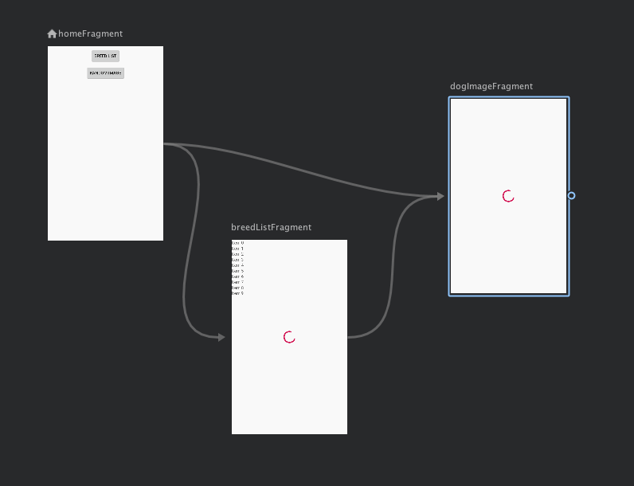

# Homework

## Navigation

For the homework you need to add a new screen to the nav_graph that will be the entry point of the application.  On the screen the user can choose between presenting the breed list and showing a random dog image.

* If the user selects the breed list then will be shown the breed list screen from which they can select a breed and then see an image for the selected breed.
* If the user selects random dog image that will be shown the dog image screen which will load a random dog image.

[Example App Video](./day_10_homework.webm)

